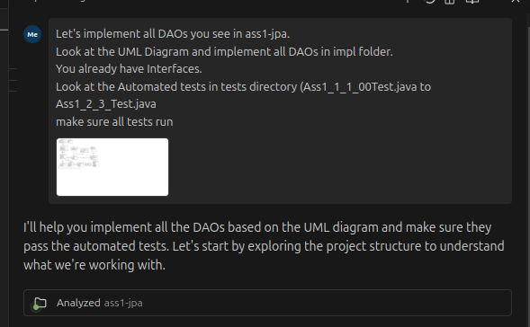
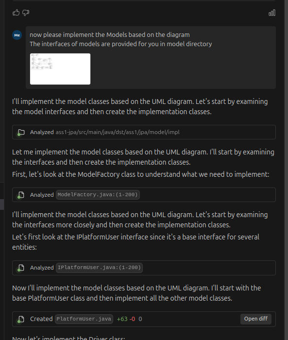

# Windsurf Demo
This repository showcases a simple application for taxi management (eg. Uber). It implements a document database using Java and Hibernate.

All the details to the Agent coder assignment can be found here: https://dsg.tuwien.ac.at/teaching/courses/dst/25/assignment-1.html

## Step by step demo

### 1. Assignment: Implementing all DAOs
Implementing DAOs is the first step in the assignment. We will use Windsurf to implement all DAOs in the application. The project already has Automated tests, testing all DAOs, as well as interfaces. Following is a step by step guide to implement all DAOs.

#### Step 1: Context for AI Agent
We now prepare the context for AI Agent. That means we give it assignment description, UML diagram, and the project structure.

1. We provide the UML Diagram
2. Point out the interfaces that needs to implement
3. provide the tests that needs to be implemented

These series of steps are done for DAO and Model Implementation

